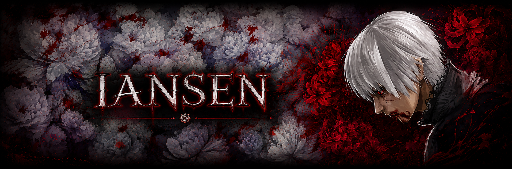

  

  <b></b>

## "May I ask what your name is?"

Hi there! I'm **Igor Iansen**, currently in the second semester of a degree in `Multiplatform Software Development`. Through practical projects and modern technologies, I am learning how to **turn ideas and real-world challenges into functional digital solutions**.

My interest in technology began during childhood, especially through video games, and grew into a passion for understanding the **logic behind digital experiences**. Today, I am focused on developing my technical skills through continuous learning, creativity, and hands-on practice, with the goal of becoming a versatile software developer.